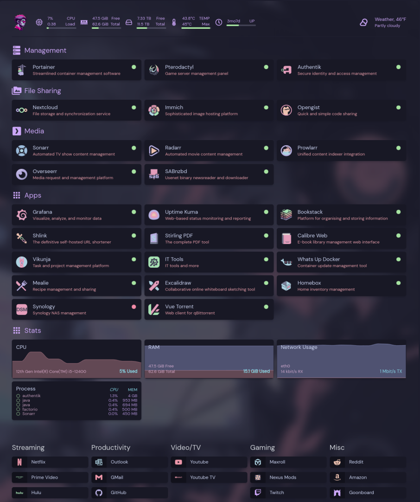

# Catppuccin for [Homepage](https://github.com/gethomepage/homepage) w/ [Icons](catppuccin_icons)
  > A dark theme for [Homepage](https://github.com/gethomepage/homepage) with Catppuccin styled icons.

Additional icons are being worked on, please [open a request issue](https://github.com/Jas-SinghFSU/homepage-catppuccin/issues/new) if you would like certain icons faster. 



# Install

## Homepage (If not installed)
If you don't have Homepage dashboard installed, you can do so with the following `docker-compose.yaml`:
```yaml
version: "3"

services:
  homepage:
    image: ghcr.io/gethomepage/homepage:latest
    container_name: homepage
    ports:
      - 3000:3000
    volumes:
      - /path/to/config/directory:/app/config # Make sure your local config directory exists
      - /path/to/images/directory:/app/public/images # This is where your images/app-icons would go
      - /var/run/docker.sock:/var/run/docker.sock # (optional) For docker integrations
```
## Instructions

### Basic
1. First, select the `gray` theme to be your default. To do so, put this anywhere in your `settings.yaml` (located in your `/path/to/config/directory`):
    ```yaml
    color: gray
    ```
2. Be sure to modify the `custom.css` file in your `/path/to/config/directory` to apply the theme. If that file is empty and/or doesn't exist, create a new one called `custom.css` and paste the contents of [custom.css](custom.css) into it.

3. To change icons for your services/bookmarks, first put them in your `/path/to/images/directory` and map the directory as shown in the `docker-compose.yaml` example. If you add any more images/icons, you will have to restart the container every time for the changes to take effect.

### Advanced
To style the following widgets, please assign them the given id. For example, to style the `calendar` widget, assign the calendar widget an ID in your `services.yaml` as shown:
```yaml
- Calendar-Group:
    - Calendar:
        id: catppuccin-calendar
        widget:
          type: calendar
          firstDayInWeek: sunday # optional - defaults to monday
          view: monthly # optional - possible values monthly, agenda
          maxEvents: 10 # optional - defaults to 10
          showTime: true # optional - show time for event happening today - defaults to false
```
#### Widget IDs for Catppuccin theme

| Widget   | id                       | example                       |
| -------- | -------                  | -------                       |
| Calendar | catppuccin-calendar         | id: catppuccin-calendar          |
| Glances  | glances-your_glance_name | id: glances-cpu               |

### Icons
All icons can be previewed [here](icons-preview.md).

```yaml
- Portainer:
        href: https://portainer.yourdomain.com
        description: Streamlined container management software
        icon: /images/portainer.svg
        server: my-docker #if integrating with docker
        container: portainer #if integrating with docker
```

### Wallpapers

Additional wallpapers made by [aynp](https://github.com/aynp) can be found [here](https://github.com/aynp/catppuccin-wallpapers).

# Team

| [](https://github.com/Jas-SinghFSU) |
| ---------------------------------------------------------------------------------------- |
| [Jas Singh](https://github.com/Jas-SinghFSU)                                               |

## License

[MIT License](./LICENSE)
